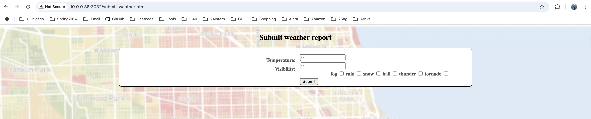
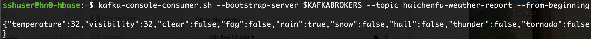
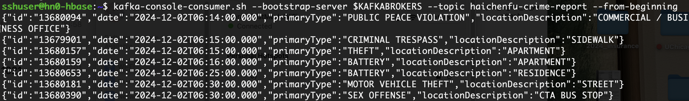

# mpcs53014-proj
github repo: https://github.com/haichenfu/mpcs53014-proj
## Project description
This project build an application to display the relationship between crime and weather in Chicago. The datapoints covered in this dashboard are weather and crime data for Chicago from 2001 to 2024. User could query by year from the web app interface to check for averaged daily crime amount on the the specific weather condition for that year. 

## Project implementation
### Part1 Data lake
#### 1.1 Crime data
https://data.cityofchicago.org/Public-Safety/Crimes-2001-to-Present/ijzp-q8t2/about_data

The crime data is retrieved from the chicago data portal with API calls to save data as csv files into the cluster. The script is displayed as below and also can be found in `datalake/get_crime.sh`
```
offset=0
limit=50000
total=8213533

while [ $offset -lt $total ]
do
    url="https://data.cityofchicago.org/resource/crimes.csv?\$select=id,date,primary_type,location_description&\$limit=$limit&\$offset=$offset"
    wget -O crimes_$offset.csv "$url"
    offset=$((offset+limit))
done
```
Then the data is loaded from cluster to our hdfs file system with script `datalake/ingest_crime_to_hdfs.sh`
```
for name in *.csv
do
  echo "Uploading $name to HDFS..."
  hdfs dfs -put "$name" /haichenfu/input/
  echo "$name uploaded successfully."
done
```
Finally, the csv files in hdfs is stored into a hive table `haichenfu_crimes_csv` with script `datalake/crime_csv_to_hive.hql`
#### 1.2 Weather data
The weather data for flight and weather app is reused in the project. The weather data is in hive table `weathersummary`
### Part2 Batch Layer
#### 2.1 Weather by year
With weather data in hive table `weathersummary`, I further categorized the weather condition for temperature and visibility with script `batch_layer/refined_weather.hql` and save the refined weather result in hive table `haichenfu_weather`. I categorized the mean temperature into very_code, code, chilly, warm, and hot, and the visibility into clear, moderate, low, poor so that we would be able to  qualitatively reflect the relationship between crime and temperature, crime and visibility in our web app.  
```
insert overwrite table haichenfu_weather 
select w.year as year, w.month as month, w.day as day, w.station as station,
w.meantemperature as mean_temperature, w.meanvisibility as mean_visibility, w.meanwindspeed as mean_windspeed,
  w.fog as fog, w.rain as rain, w.snow as snow, w.hail as hail, w.thunder as thunder, w.tornado as tornado,
  if (w.meanvisibility >= 30, true, false) as visibility_clean,
  if (w.meanvisibility < 30 and w.meanvisibility >= 10, true, false) as visibility_moderate,
  if (w.meanvisibility < 10 and w.meanvisibility >= 2, true, false) as visibility_low,
  if (w.meanvisibility < 2, true, false) as visibility_poor,
  if (w.meantemperature < 32, true, false) as temp_very_cold,
  if (w.meantemperature >= 32 and w.meantemperature < 50, true, false) as temp_cold,
  if (w.meantemperature >= 50 and w.meantemperature < 65, true, false) as temp_chilly,
  if (w.meantemperature >= 65 and w.meantemperature < 80, true, false) as temp_warm,
  if (w.meantemperature >= 80, true, false) as temp_hot 
from weathersummary w;
```
With all weather conditions clearly categorized, it allows us to count the occurance of weather conditions in each year with script `batch_layer/weather_by_year.hql` and save the counted occurance of weather by year into hive table `haichenfu_weathers_by_year`. As we only cares about the weather in Chicago, I use the weather data collected from station 725340. 
```
insert overwrite table haichenfu_weathers_by_year
select w.year as year, 
sum(if(!w.fog and !w.rain and !w.snow and !w.hail and !w.thunder and !w.tornado, 1, 0)) as clear_count,
sum(if(w.fog, 1, 0)) as fog_count,
sum(if(w.rain, 1, 0)) as rain_count,
sum(if(w.snow, 1, 0)) as snow_count,
sum(if(w.hail, 1, 0)) as hail_count,
sum(if(w.thunder, 1, 0)) as thunder_count,
sum(if(w.tornado, 1, 0)) as tornado_count,
sum(if(w.visibility_clean, 1, 0)) as visibility_clean_count,
sum(if(w.visibility_moderate, 1, 0)) as visibility_moderate_count,
sum(if(w.visibility_low, 1, 0)) as visibility_low_count,
sum(if(w.visibility_poor, 1, 0)) as visibility_poor_count,
sum(if(temp_very_cold, 1, 0)) as temp_very_cold_count,
sum(if(temp_cold, 1, 0)) as temp_cold_count,
sum(if(temp_chilly, 1, 0)) as temp_chilly_count,
sum(if(temp_warm, 1, 0)) as temp_warm_count,
sum(if(temp_hot, 1, 0)) as temp_hot_count
from haichenfu_weather w
where w.station = 725340
group by w.year;
```
#### 2.2 Crime by year
In order to know about the weather condition of each crime record, I joined the hive table `haichenfu_crime_csv` and `haichenfu_weather` on year, month, day (date in `haichenfu_crime_csv` table) with script `batch_layer/join_crime_to_weather.hql`. As mentioned before, the weather data collected by station 725340 is used for Chicago weather. 
```
insert overwrite table haichenfu_crimes_and_weathers
select w.year as year, w.month as month, w.day as day, c.PrimaryType as primary_type,
w.mean_temperature as mean_temperature, w.mean_visibility as mean_visibility, w.mean_windspeed as mean_windspeed,
  w.fog as fog, w.rain as rain, w.snow as snow, w.hail as hail, w.thunder as thunder, w.tornado as tornado,
  w.visibility_clean as visibility_clean, w.visibility_moderate as visibility_moderate, w.visibility_low as visibility_low,
  w.visibility_poor as visibility_poor, w.temp_very_cold as temp_very_cold, w.temp_cold as temp_cold,
  w.temp_chilly as temp_chilly, w.temp_warm as temp_warm, w.temp_hot as temp_hot
from haichenfu_crimes c 
join haichenfu_weather w
on year(from_unixtime(unix_timestamp(c.crimedate, 'yyyy-MM-dd\'T\'HH:mm:ss.SSS'))) = w.year
and month(from_unixtime(unix_timestamp(c.crimedate, 'yyyy-MM-dd\'T\'HH:mm:ss.SSS'))) = w.month
  and day(from_unixtime(unix_timestamp(c.crimedate, 'yyyy-MM-dd\'T\'HH:mm:ss.SSS'))) = w.day
and w.station = 725340;
```
With weather conditions for crime records processed, we are able to summarize the occurance of crime on each weather conditions by year with `batch_layer/crimes_by_year.hql` and save the result in hive table `haichenfu_crimes_by_year`. This table serves as the basis to be loaded into hbase for our serving layer. 
```
insert overwrite table haichenfu_crimes_by_year
select w.year as year, 
sum(if(!w.fog and !w.rain and !w.snow and !w.hail and !w.thunder and !w.tornado, 1, 0)) as clear_crime,
sum(if(w.fog, 1, 0)) as fog_crime,
sum(if(w.rain, 1, 0)) as rain_crime,
sum(if(w.snow, 1, 0)) as snow_crime,
sum(if(w.hail, 1, 0)) as hail_crime,
sum(if(w.thunder, 1, 0)) as thunder_crime,
sum(if(w.tornado, 1, 0)) as tornado_crime,
sum(if(w.visibility_clean, 1, 0)) as visibility_clean_crime,
sum(if(w.visibility_moderate, 1, 0)) as visibility_moderate_crime,
sum(if(w.visibility_low, 1, 0)) as visibility_low_crime,
sum(if(w.visibility_poor, 1, 0)) as visibility_poor_crime,
sum(if(w.temp_very_cold, 1, 0)) as temp_very_cold_crime,
sum(if(w.temp_cold, 1, 0)) as temp_cold_crime,
sum(if(w.temp_chilly, 1, 0)) as temp_chilly_crime,
sum(if(w.temp_warm, 1, 0)) as temp_warm_crime,
sum(if(w.temp_hot, 1, 0)) as temp_hot_crime,
y.clear_count as clear_count,
y.fog_count as fog_count,
y.rain_count as rain_count,
y.snow_count as snow_count,
y.hail_count as hail_count,
y.thunder_count as thunder_count,
y.tornado_count as tornado_count,
y.visibility_clean_count as visibility_clean_count,
y.visibility_moderate_count as visibility_clean_count,
y.visibility_low_count as visibility_low_count,
y.visibility_poor_count as visibility_poor_count,
y.temp_very_cold_count as temp_very_cold_count,
y.temp_cold_count as temp_cold_count,
y.temp_chilly_count as temp_chilly_count,
y.temp_warm_count as temp_warm_count,
y.temp_hot_count as temp_hot_count
from haichenfu_crimes_and_weathers w
join haichenfu_weathers_by_year y 
on w.year = y.year
group by w.year, y.clear_count,y.fog_count, y.rain_count, y.snow_count, y.hail_count, y.thunder_count, y.tornado_count,y.visibility_clean_count, y.visibility_moderate_count, y.visibility_low_count, y.visibility_poor_count, y.temp_very_cold_count, y.temp_cold_count, y.temp_chilly_count, y.temp_warm_count, y.temp_hot_count;
```

### Part3 Serving Layer
Firstly, we create a table in Hbase shell with command: 
```
create 'haichenfu_crimes_by_years_hbase', 'crime'
```
The hive table `haichenfu_crimes_by_year` is loaded into Hbase with script `serving_layer/crimes_by_year_hbase.hql`. 
```
create external table haichenfu_crimes_by_years_hbase (
    year int, clear_crime bigint, fog_crime bigint, rain_crime bigint, snow_crime bigint,
    hail_crime bigint, thunder_crime bigint, tornado_crime bigint, visibility_clean_crime bigint,
    visibility_moderate_crime bigint, visibility_low_crime bigint, visibility_poor_crime bigint,
    temp_very_cold_crime bigint, temp_cold_crime bigint, temp_chilly_crime bigint, temp_warm_crime bigint,
    temp_hot_crime bigint, 
    clear_count bigint, fog_count bigint, rain_count bigint, snow_count bigint,
    hail_count bigint, thunder_count bigint, tornado_count bigint, visibility_clean_count bigint,
    visibility_moderate_count bigint, visibility_low_count bigint, visibility_poor_count bigint,
    temp_very_cold_count bigint, temp_cold_count bigint, temp_chilly_count bigint, temp_warm_count bigint,
    temp_hot_count bigint
)
STORED BY 'org.apache.hadoop.hive.hbase.HBaseStorageHandler'
WITH SERDEPROPERTIES ('hbase.columns.mapping' = ':key,crime:clear_crime#b,crime:fog_crime#b,crime:rain_crime#b,crime:snow_crime#b,crime:hail_crime#b,crime:thunder_crime#b,crime:tornado_crime#b,crime:visibility_clean_crime#b,crime:visibility_moderate_crime#b,crime:visibility_low_crime#b,crime:visibility_poor_crime#b,crime:temp_very_cold_crime#b,crime:temp_cold_crime#b,crime:temp_chilly_crime#b,crime:temp_warm_crime#b, crime:temp_hot_crime#b,crime:clear_count#b,crime:fog_count#b,crime:rain_count#b,crime:snow_count#b,crime:hail_count#b,crime:thunder_count#b,crime:tornado_count#b,crime:visibility_clean_count#b,crime:visibility_moderate_count#b,crime:visibility_low_count#b,crime:visibility_poor_count#b,crime:temp_very_cold_count#b,crime:temp_cold_count#b,crime:temp_chilly_count#b,crime:temp_warm_count#b, crime:temp_hot_count#b')
TBLPROPERTIES ('hbase.table.name' = 'haichenfu_crimes_by_years_hbase');
```
The row key for this hbase table is year (e.g. "2023", "2024"), and we store occurance of crime on specific weather, and occurance of the weather in \<weather\>_crime, \<weather\>_count. To calculate the averaged daily crime amount on the the specific weather condition for that year, we can query the hbase by year and calculate average with \<weather\>_crime / \<weather\>_count. 
### Part4 Web App
On cluster, we can start the webapp with command 
```
ssh -i ~/.ssh/mpcs53014 -C2qTnNf -D 9876 sshuser@hbase-mpcs53014-2024-ssh.azurehdinsight.net
cd haichenfu/app
node app.js 3032 https://hbase-mpcs53014-2024.azurehdinsight.net/hbaserest $KAFKABROKERS
```
The webapp will be able to accessed at http://10.0.0.38:3032/. 
### Part5 Speed Layer
#### 5.1.1 Weather data feed
I simulated the real-time weather report with weather form here as I fail to find the appropriate real-time weather feed that could feed in the weather condition data as expected. The weather form can be accessed at http://10.0.0.38:3032/submit-weather.html. 

The weather report is sent to a Kafka topic named `haichenfu-weather-report`. The messages in this Kafka topic can be checked with command:
```
kafka-console-consumer.sh --bootstrap-server $KAFKABROKERS --topic haichenfu-weather-report --from-beginning 
```
The weather report received by the kafka topic will be shown as 

#### 5.1.2 Crime data feed
The real-time crime data is retrieved by call to the api https://data.cityofchicago.org/resource/ijzp-q8t2.json (API documentation https://dev.socrata.com/foundry/data.cityofchicago.org/ijzp-q8t2). The Java program to retrieve the real-time crime data is inside `speed_layer/crime_report`
In the `StreamCrimeIntoKafka` java class, we trigger the retrieving of crime records every 60 minutes (since the crime record update with our data source is relatively slow, and even within the 60 minutes interval, it is not guaranteed to have new crime record added into the data set). If we retrieved with some new crime records, it will be sent to a Kafka topic named `haichenfu-crime-report`. 
The crime report program is deployed to our cluster and can be run with
```
cd haichenfu/crime_report/target
java -cp uber-crime_report-1.0-SNAPSHOT.jar org.example.StreamCrimeIntoKafka $KAFKABROKERS
```
The messages in the `haichenfu-crime-report` can be checked with command: 
```
kafka-console-consumer.sh --bootstrap-server $KAFKABROKERS --topic haichenfu-crime-report --from-beginning 
```
The crime report received by the kafka topic will be displayed as 

#### 5.2.1 Weather data processing
The messages in the `haichenfu-weather-report` kafka is retrieved and processed into an Hbase table `haichenfu_latest_weather` with code in `speed_layer/weather-speed`. 
The Hbase table is created with command listed below and we have station to be its row key (station is "725340" by default so this Hbase table will only have one row of data)
```
create 'haichenfu_latest_weather', 'weather'
```
```
val batchStats = reports.map(wr => {
      val put = new Put(Bytes.toBytes("725340"))
      put.addColumn(Bytes.toBytes("weather"), Bytes.toBytes("clear"), Bytes.toBytes(wr.clear))
      put.addColumn(Bytes.toBytes("weather"), Bytes.toBytes("fog"), Bytes.toBytes(wr.fog))
      put.addColumn(Bytes.toBytes("weather"), Bytes.toBytes("rain"), Bytes.toBytes(wr.rain))
      put.addColumn(Bytes.toBytes("weather"), Bytes.toBytes("snow"), Bytes.toBytes(wr.snow))
      put.addColumn(Bytes.toBytes("weather"), Bytes.toBytes("hail"), Bytes.toBytes(wr.hail))
      put.addColumn(Bytes.toBytes("weather"), Bytes.toBytes("thunder"), Bytes.toBytes(wr.thunder))
      put.addColumn(Bytes.toBytes("weather"), Bytes.toBytes("tornado"), Bytes.toBytes(wr.tornado))
      put.addColumn(Bytes.toBytes("weather"), Bytes.toBytes("temperature"), Bytes.toBytes(wr.temperature))
      put.addColumn(Bytes.toBytes("weather"), Bytes.toBytes("visibility"), Bytes.toBytes(wr.visibility))
      table.put(put)
    })
    batchStats.print()
```
The code is deployed to our cluster and can be run with command
```
cd haichenfu/weather_speed/target
spark-submit --driver-java-options "-Dlog4j.configuration=file:///home/sshuser/ss.log4j.properties" --class StreamWeather uber-weather-speed-1.0-SNAPSHOT.jar $KAFKABROKERS
```
#### 5.2.2 Crime data processing
The messages in `haichenfu-crime-report` kafka is retrieved and processed into Hbase table `haichenfu_crimes_by_years` with code in `speed_layer/crime-speed`.
We firstly retrieve the latest weather from Hbase table `haichenfu_latest_weather` for station "725340", and increment the \<weather\>_count, \<weather\>_crime by 1 when processing each new crime records from our kafka messages. 
The code is deployed to our cluster and can be run with command
```
cd haichenfu/crime_speed/target
spark-submit --driver-java-options "-Dlog4j.configuration=file:///home/sshuser/ss.log4j.properties" --class StreamCrimes uber-crime-speed-1.0-SNAPSHOT.jar $KAFKABROKERS
```
