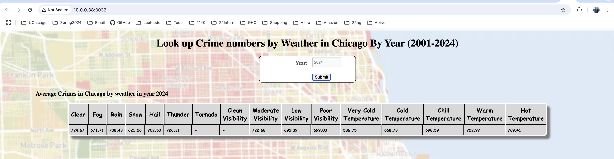

# mpcs53014-proj
github repo: https://github.com/haichenfu/mpcs53014-proj
## Project description
This project build an application to display the relationship between crime and weather in Chicago. The datapoints covered in this dashboard are weather and crime data for Chicago from 2001 to 2024. User could query by year from the web app interface to check for averaged daily crime amount on the the specific weather condition for that year. 

## Project implementation
### Part1 Data lake
#### 1.1 Crime data
https://data.cityofchicago.org/Public-Safety/Crimes-2001-to-Present/ijzp-q8t2/about_data

The crime data is retrieved from the chicago data portal with API calls to save data as csv files into the cluster. The script is displayed as below and also can be found in `datalake/get_crime.sh`
```
offset=0
limit=50000
total=8213533

while [ $offset -lt $total ]
do
    url="https://data.cityofchicago.org/resource/crimes.csv?\$select=id,date,primary_type,location_description&\$limit=$limit&\$offset=$offset"
    wget -O crimes_$offset.csv "$url"
    offset=$((offset+limit))
done
```
Then the data is loaded from cluster to our hdfs file system with script `datalake/ingest_crime_to_hdfs.sh`
```
for name in *.csv
do
  echo "Uploading $name to HDFS..."
  hdfs dfs -put "$name" /haichenfu/input/
  echo "$name uploaded successfully."
done
```
Finally, the csv files in hdfs is stored into a hive table with script `datalake/crime_csv_to_hive.hql`
#### 1.2 Weather data
The weather data for flight and weather app is reused in the project. The weather data is in hive table `weathersummary`
### Part2 Batch Layer
### Part3 Serving Layer
### Part4 Web App
### Part5 Speed Layer
